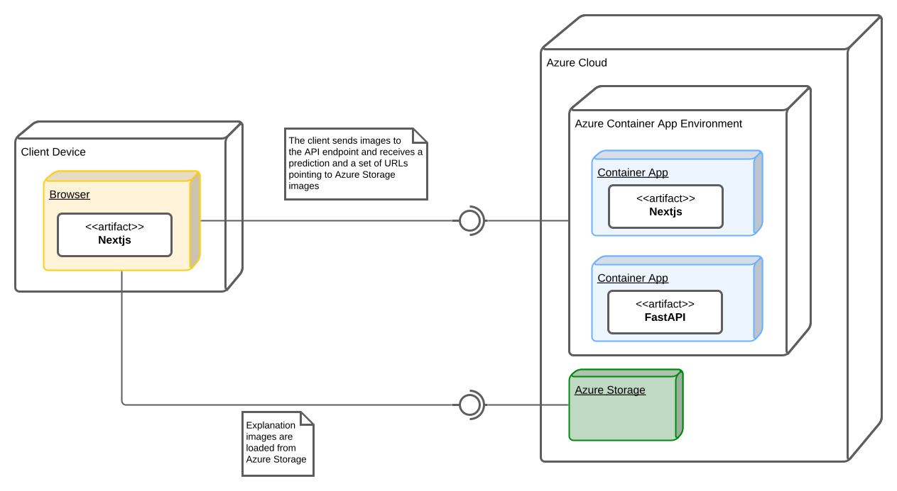

<!-- Improved compatibility of back to top link: See: https://github.com/othneildrew/Best-README-Template/pull/73 -->
<a id="readme-top"></a>

<!-- PROJECT LOGO -->
<br />
<div align="center">


<h3 align="center">Case-based Explanations Demo</h3>

  <p align="center">
    A website which demonstrates how case-based explanations help explain the rationale behind Machine Learning classifiers' decisions.
    <br />
    <br />
    <a href="explanations.fcampos.dev">View Demo</a>
    ·
    <a href="https://github.com/filipepcampos/case-based-explanations-demo/issues/new?labels=bug">Report Bug</a>
    ·
    <a href="https://github.com/filipepcampos/case-based-explanations-demo/issues/new?labels=enhancement">Request Feature</a>
  </p>
</div>


<!-- TABLE OF CONTENTS -->
<details>
  <summary>Table of Contents</summary>
  <ol>
    <li>
      <a href="#about-the-project">About The Project</a>
      <ul>
        <li><a href="#built-with">Built With</a></li>
      </ul>
    </li>
    <li>
      <a href="#getting-started">Getting Started</a>
      <ul>
        <li><a href="#azure-cloud">Azure Cloud</a></li>
        <li><a href="#local">Local</a></li>
      </ul>
    </li>
    <li><a href="#license">License</a></li>
  </ol>
</details>


<!-- ABOUT THE PROJECT -->
## About The Project

[![Product Name Screen Shot][product-screenshot]](images/screenshot.png)

<p align="right">(<a href="#readme-top">back to top</a>)</p>

### Built With

This project was built using [Next.js](https://nextjs.org/) for the frontend which communicates with an API backend powered by [FastAPI](https://fastapi.tiangolo.com/).
The model was trained using [PyTorch](https://pytorch.org/) and the [PyTorch Lightning](https://lightning.ai/docs/pytorch/stable/) framework.
We deploy the website on [Azure Cloud](https://azure.microsoft.com) through the use of [Terraform](https://www.terraform.io/) scripts.

**Infrastructure Diagram:**



<p align="right">(<a href="#readme-top">back to top</a>)</p>

## Getting Started

Interested in running or modifying this project? Here's an overview of how to get the project up and running.

### Azure Cloud

This project was developed with Azure deployment in mind. The infrastructure consists of two main components, `storage` and `container-apps`, which are deployed separately using [Terraform](https://www.terraform.io/). For more detailed instructions refer to the [README.md](deploy/README.md) file within said directory.

### Local

#### Docker

The simplest option to run locally is to use the prebuilt docker images published on Docker Hub for both the [frontend](https://hub.docker.com/repository/docker/filipepcampos/frontend/general) and [api](https://hub.docker.com/repository/docker/filipepcampos/api/general). Simply run:

```sh
docker -p 80:80 run filipepcampos/api
docker -p 3000:3000 run filipepcampos/frontend
```

#### Local Development

Run both the [Nextjs Frontend](frontend/README.md) and [FastAPI Backend](api/README.md) according to the readme of their respective directories.

<p align="right">(<a href="#readme-top">back to top</a>)</p>


<!-- LICENSE -->
## License

Distributed under the GPL-3.0 License. See `LICENSE` for more information.

<p align="right">(<a href="#readme-top">back to top</a>)</p>


<!-- MARKDOWN LINKS & IMAGES -->
[product-screenshot]: images/screenshot.png
